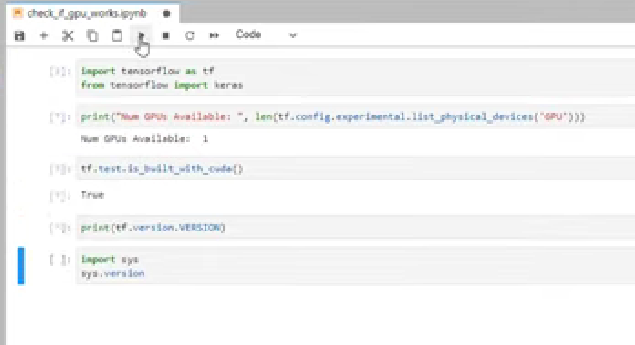

# Summary
TLDRThe script introduces ITFreeTraining's free CompTIA A+ certification course, highlighting CompTIA's role as a non-profit vendor-neutral certification provider since 1982. It emphasizes the A+ certification's value for entry-level technicians, suggesting it can aid in securing first IT jobs, despite experience often being more influential. The course uses a color-coding system to prioritize exam content and includes 'In The Real World' sections for practical insights, differentiating exam strategies from real-life applications. It also recommends Total Seminars for exam materials without any affiliate benefits.

# Takeaways
- 📚 CompTIA A+ is a certification course created by CompTIA, a non-profit organization established in 1982, offering vendor-neutral certifications across various IT domains.
- 🛠️ The A+ certification focuses on fundamental concepts and skills rather than specific vendor technologies, making it a versatile qualification for IT professionals.
- 📝 The certification consists of two exams, and ITFreeTraining aims to provide video content for both, contingent upon funding.
- 👷 A+ certification is recommended for entry-level technicians with 12 months of hands-on experience, though it's not a strict requirement for certification.
- 💼 Securing an IT job can be challenging without experience, but an A+ certification can provide an advantage and potentially facilitate employment.
- 🔍 A certification like A+ validates entry-level technical skills and can corroborate the skills claimed by an individual's experience.
- 🎨 ITFreeTraining uses a color-coding scheme to categorize the importance of information for the exam: Green for essential knowledge, Blue for likely exam content, Orange for nice-to-know, and Red for in-depth supplementary content.
- 🏢 'In The Real World' sections of the training apply theoretical knowledge to practical scenarios, offering insights that may not be covered in the exam but are useful in real-life IT work.
- 🔄 The script highlights the difference between exam mindset and real-world application, such as the discretionary nature of backups in real-world scenarios versus the exam's assumption of data criticality.
- 🛒 For those interested in commercial study materials, Total Seminars is recommended for exam guides, questions, and vouchers, often available at a discount.
- 👋 The script concludes with an invitation to continue with the course and thanks viewers for watching.

# Q & A
## What is CompTIA and when was it established?
- CompTIA is a non-profit organization established in 1982 that provides vendor-neutral certifications in various IT-related fields such as computer hardware, networking, cloud, security, and Linux.

## What does 'vendor-neutral' mean in the context of CompTIA certifications?
- A 'vendor-neutral' approach means that CompTIA does not focus solely on one vendor's products, but rather emphasizes fundamental concepts and skills that are applicable across different technologies and vendors.

## How many exams are there in the CompTIA A+ certification and what is the recommended prerequisite for taking these exams?
- The CompTIA A+ certification consists of two exams. It is recommended for entry-level technicians with 12 months of hands-on experience, although it is not a strict requirement.

## What is the significance of obtaining the A+ certification for someone without prior IT experience?
- Obtaining the A+ certification can give an edge to someone without prior IT experience, potentially facilitating the acquisition of their first IT job, as it validates entry-level technical skills.

## How does the A+ certification serve as evidence of an individual's skills?
- The A+ certification serves as evidence that an individual possesses the skills claimed by their experience, corroborating and authenticating their technical abilities.

## What is the role of experience compared to certification in hiring decisions?
- While certifications like the A+ can play a valuable role, experience tends to be a more influential factor in hiring decisions as it demonstrates practical application of skills.

## What is the purpose of the color-coding scheme used in ITFreeTraining's course slides?
- The color-coding scheme is used to help learners understand the importance of the information for the exam: green for essential knowledge, blue for good to know, orange for nice to know, and red for supplementary content.

## What does the 'In The Real World' section of the training aim to provide?
- The 'In The Real World' section aims to apply the knowledge taught to real-world scenarios, providing additional context and information that may not be covered by the exam but is useful in practical situations.

## Why might an employer view an A+ certification as a cost-saving measure?
- An employer might view the A+ certification as a cost-saving measure because it indicates that the candidate has the necessary skills, potentially saving the employer money on training new employees.

## What is the recommended approach for handling backups in the context of the CompTIA A+ exam?
- For the exam, it is prudent to assume that all data is critical and irreplaceable, and thus, a backup should always be performed unless the question specifically indicates that the data can be lost.

## Why would ITFreeTraining recommend Total Seminars for purchasing commercial materials?
- ITFreeTraining recommends Total Seminars because they provide comprehensive exam guides, questions, and vouchers, often at a discount, although ITFreeTraining does not receive any benefits for the recommendation.

# Mindmap

# Keywords
- 💡CompTIA A+
CompTIA A+ is a certification program created by CompTIA, a non-profit organization that provides vendor-neutral certifications in various IT fields. The certification is designed for entry-level technicians and validates fundamental IT skills. In the script, it is mentioned as the main focus of the training course, with two exams that the video content aims to cover.
- 💡Vendor-neutral certifications
Vendor-neutral certifications are credentials that are not tied to any specific technology or vendor. They focus on general skills and knowledge applicable across different systems and products. CompTIA is highlighted in the script as an organization that provides such certifications, emphasizing the broad applicability of the A+ certification.
- 💡Exams
In the context of the video, exams refer to the tests that one must pass to obtain the CompTIA A+ certification. The script mentions that the A+ certification consists of two exams, indicating the structured nature of the certification process.
- 💡Entry-level technician
An entry-level technician is someone who is starting their career in a technical field and typically has limited experience. The script suggests that the A+ certification is recommended for such individuals, particularly those with 12 months of hands-on experience.
- 💡Hands-on experience
Hands-on experience refers to practical, direct involvement in tasks or activities, as opposed to theoretical knowledge. The script mentions that having 12 months of hands-on experience is recommended for the A+ certification, emphasizing the importance of real-world skills in addition to certification.
- 💡Certification
A certification is a formal recognition of an individual's skills and knowledge in a specific area. In the script, the A+ certification is discussed as a way to validate technical skills and potentially give an advantage in job applications within the IT industry.
- 💡Color-coding scheme
The color-coding scheme mentioned in the script is a teaching tool used to categorize the importance of information for exam preparation. Green signifies essential knowledge, blue indicates good-to-know information, orange is for nice-to-know content, and red is for supplementary, in-depth content.
- 💡In The Real World
In The Real World sections of the training course, as described in the script, are designed to apply the theoretical knowledge taught to practical scenarios that one might encounter in the workplace. These sections provide additional context and information beyond what is covered in the exam.
- 💡Backup
A backup refers to a copy of data that is kept separately from the original to protect against data loss. The script discusses the importance of backups in the context of the exam, where it is assumed that all data is critical, and also contrasts this with real-world scenarios where backups might be discretionary.
- 💡Total Seminars
Total Seminars is a company mentioned in the script that provides commercial materials for exam preparation, including guides, questions, and vouchers. The script recommends Total Seminars as a resource for those interested in purchasing study materials for the CompTIA A+ certification exams.
- 💡Exam vouchers
An exam voucher is a certificate or authorization code that allows an individual to take a certification exam at a testing center. The script suggests that purchasing a voucher through Total Seminars can be more cost-effective than buying the exam directly.

# Highlights
- CompTIA is a non-profit organization established in 1982 that provides vendor-neutral certifications on various topics including computer hardware, networking, cloud, security, and Linux.
- A+ certification consists of two exams and is recommended for entry-level technicians with 12 months of hands-on experience.
- Obtaining A+ certification can give an edge and facilitate getting the first job in IT, even without prior experience.
- A certification like A+ validates entry-level technical skills and provides evidence of possessing the skills claimed by experience.
- In some cases, having the A+ certification can save employers money on training as they don't have to pay for it.
- ITFreeTraining provides additional context on topics and covers information that may not be in the exam but is useful in the workplace.
- The training uses a color-coding scheme to help learners understand what they need to know for the exam: Green (high probability of being asked), Blue (fair game for exam question), Orange (nice to know, unlikely to be asked), and Red (supplementary content for deeper understanding).
- The 'In The Real World' sections apply the taught knowledge to real-world scenarios, addressing how to apply the knowledge when it differs from what is learned.
- CompTIA may include topics on certain hardware that is no longer manufactured or has a better alternative in the real world.
- For exam purposes, it's prudent to assume all data is critical and irreplaceable unless explicitly indicated otherwise.
- In the real world, deciding to perform a backup is often discretionary and may not be necessary in certain situations.
- Total Seminars is recommended for purchasing commercial materials, offering exam guides, questions, and vouchers with potential discounts.
- ITFreeTraining does not receive any benefits for recommending Total Seminars and cannot provide discount codes.
- The transcript emphasizes the importance of understanding both the theoretical and practical aspects of IT certification and real-world application.
- The course aims to provide video content for both A+ exams, mainly relying on funding for its creation.
- Experience tends to be a more influential factor in hiring decisions, but a certification can still play a valuable role.
- Building your own computer system or doing volunteer work can substitute for the required 12 months of experience if not met.