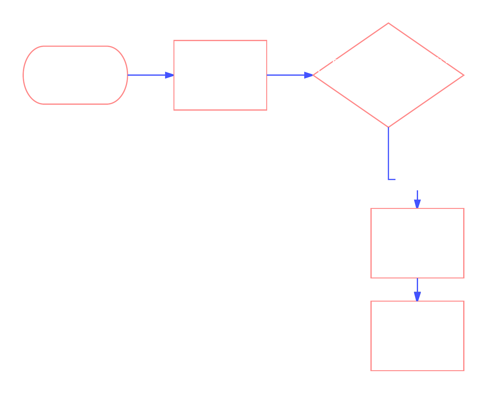
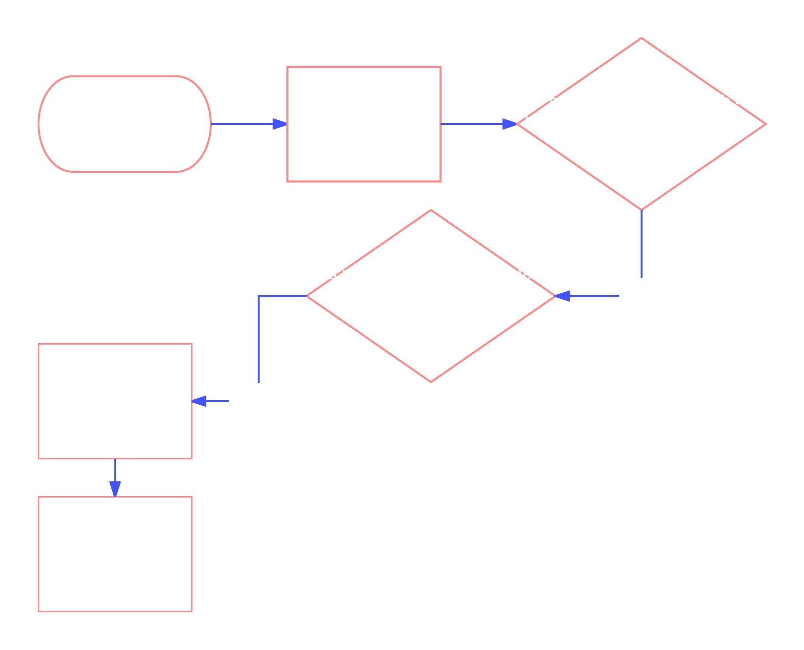
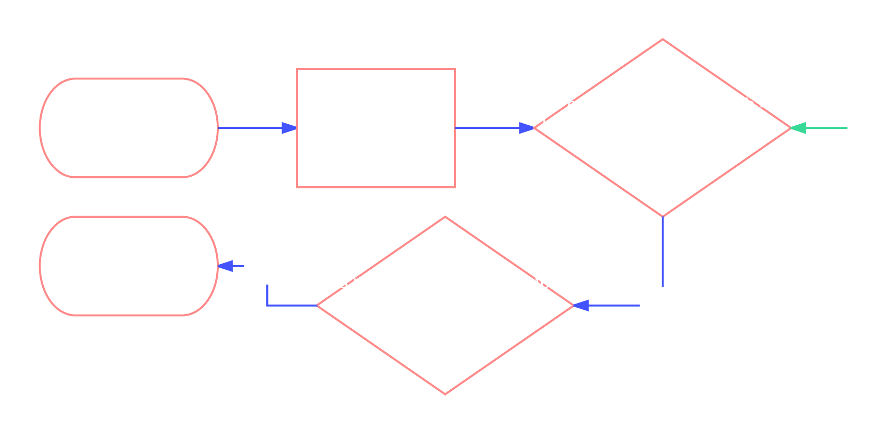

BLOCKCHAIN
	A blockchain is a distributed database secured by cryptography. It is the technology behind Bitcoin.
	A blockchain has a list of blocks. It starts with a single block, called the genesis block.
	Each block stores the following information : index, timestamp, hash, previous hash, data, nonce.
||
INDEX
	The index is the position of the block in the chain.
	The genesis block has an index of 0. The next block will have an index of 1.

TIMESTAMP
	A record of when the block was created.
	The timestamp helps to keep the blockchain in order.

HASH
	A hash looks like a bunch of random numbers and letters.
	It is a alphanumeric value that uniquely identifies data, or the "digital fingerprint" of data.
	Properties of a hash:
		Hash has a fixed length.
		Same data always maps to same hash.
		Diffirent data always maps to a different hash [within practical limitations].
		Is easy to compute.
		Is infeasible to convert hash to data.
		A small change in data leads to a target change in hash.
	A valid hash for a blockchain is a hash that meets a certain requirement. For this blockchain. *This is the difficulty.
	A hash function takes data as input, and return a unique hash.Since the hash is a "digital fingerprint" of the entire block, the data is the combination of index, timestamp, previous hash, block data and nonce.

PREVIOUS HASH
	The previous hash is the hash of the previous block.
	The genesis block's previous hash is "0" because there is no previous block.

DATA
	Each block can store data against it.
	In cryptocurrencies such as Bitcoin, the data would include money transactions.

NONCE
	The nonce is the number used to find a valid hash.
	To find a valid hash, we need to find a nonce value that will produce a valid hash when used with the rest of the information from that block.
||
MINING A BLOCK
	The process of determining the nonce is called mining.
	We start with a nonce of 0 and keep ncrementing it by 1 until we find a valid hash.
	As difficulty increases, the number of possible valid hashes decreases. With fewer possible valid hashes, it takes more processing power to dinf a valid hash.
	
DATA MUTATION AND EFFECT
	Since data is an input cariable for the hash, changing the data will change the hash.
	The new hash will not satify requirement's block or subsequent blocks will also be invalid.
	A hash change will cause a mutation in the previous hash of subsequent blocks. Since previous hash is used to calculate the hash, subsequent hashes, subsequent hashes will also change.
	This will lead to a cascading invalidation of blocks.

PEER-TO-PEER NETWORK
	A global network of computers work together to keep the blockchain secure, correct, and consistent.
PEER STATUS
	Currently active, Connected, Disconnected.
	Peers ask each other;s blocks to detemine who has the most up-to=-data blockchain.
PEER COMMUNICATION
	

	P2P TOUR PT.1
		
		0. Start with the genesis block.
		1. Add a peer and connect.
		2. Add a block.
		3. Check history between peer.

	P2P TOUR PT.2
		
		0. Start with the genesis block.
		1. Add TWO blocks.
		2. Add peer and connect.
		3. Check history between peer.
		The longer valid chain takes precedent over a shorter chain. Also called longest chain rule.

	P2P TOUR PT.3
		
		After receiving the longest valid chain, it will broadcast its latest block to its peers.
		Eventually, all the peers on the network will have the longest chain.

IMMUTABILITY
	If a block is mutated, the block, and subsequent blocks become invalid.
	Invalid blocks are rejected by the peers on the network. They need to be re-mined to be valid.
	Earlier blocks will be harder to corrupt because there are more subsequent invalid block to re-mine.
	Becasue peers on the network are always adding new valid blocks, the hacker would have to outmine the network, which requres majority processing power.

51% ATTACK
	If a participant has more than 51% of the network, he could out-mine the network and hack the blockchain.
	When there are more miners in the network, the processing power becomes more districuted and no one has majority power. This leads to a more secure blockchain.