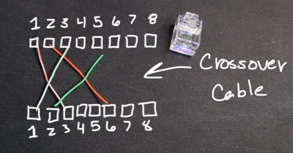
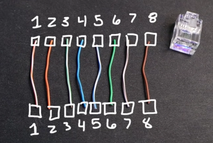

- EMI Electro magnetice interference
- Cross-talk
twisted together : Twisting these wires together help with EMI and Cross-talk.
=> UTP cable (Unshielded Twisted Pair)
also have STP have a shield benear the jacket of cable be often used in factory where have a ton of EMI.

copper wires (8 with 4 pair) is realy grate at conducting electricity.
Our wire category is 5e cable or Cat5e ethernet cable (official name is 1000BASE-T cable).
But it was a one time thing have 2 pair (10BASE-T cable, Cat3).

How data is sent over an ethernet cable == changing the voltage.

Cat3
A pair of wires is used to send data TX (transmit)
the other pair of wire that are used for RC (receive)

Inside the ethernet head have eight pin-outs
    for cat3
- send data in pin 1 and 2 white/orange orange
- receive data in pin 3 and 6 white/blue blue
And most of the time, who's on the other and is SWITCH, which swith TX and RC.

Raspberry Pie have one have built-in, an Ethernet NIC (network interface card)

what if there is no switch on the other end?
what if we want to connect to our Raspberry Pie is another Raspberry Pie?
when Bob is talking to Harry, he is not talking through his mouth, they are talking out of thier ear

how ablout 1000BATE-T 

1, 2 TX-RC
3, 6 RC
(*they can send and receive data simultaneously) this mean pin 1 and 3 can both send and receive at the same time.

how to make a cross-cable : 1 side 568A and the other side 568B.
straight through both side same type.
According to the Gigabit Etheret standard, o need to cross over, it's lke magic

SWITCH have feature called Auto MDI-X to detect which pin to receive and send. That only change pin correspond to what the person is plugging in 

1000BASE-T cable has only one limitation -- Late Collisions (<100m, if more than that we may need to maybe a fiber)

Cat6A  10GBASE-TxxxxxxxxxxxxxxcS