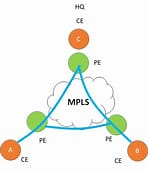

corporate office : 2-tier, 3-tier architecture
house : normal
-> : LAN local area network

data center : spine/leaf switch (topology)
* centralized services
 
how does our corporate connect to our data center? how about client store too (if any) ?

geographically separate
* WAN could be included the internet
learn about WAN : wide area network

lear up terms:
typically inside our corporate or our data center or our house will call a LAN

anything outside those contained network, whosse private network will call a WAN 
why do we need that ? Because centralizeed services.

WAN topology :
+ leased line : leased a cable
it's not as fast as ethernet cable.
    T1 -> 1.54 mbps
    T3 -> 43.736 mbps
    (Europe with comparable speeds)
    
    ++ simple, just for your traffic
    -- expensive and hard to connect a punch of location

+ MPLS (multi protocol label switching), *internet provider, *carrier: not the internet, it's all about connecting our sites, only our traffic that is going to across this stuff
    

    the router use to connect to provider's MPLS network is CE router (customer edge router).
    the router which we connecting to is PE router (provider edge router).
    
    ++ private, virtual circuits - VPN (virtual private network), safe, secure
    -- sharing out path with other customer

    it's actualy a 2.5 layer
    use label switching to keep secure but not rely on encrypttion
  

+ Metro ethernet : is like  just kind a cable

  
    E - Line (EVC : Ethernet Virtual Circuit, EPL : ethernet private line) P2P
    E - LAN : multipoint connectivity * single point of failure
    E - Tree (VPL : etherner virtual private line): P2MP, hub-and-spoke

    
+ SD - WAN (software define)

    a normal topology, internet connection, - public internet. That useing site-to-site, VPN encrypted packet which only 2 site can understand, simple, cheaper. Standard 

    so why people often prefer using mpls. Becasue the above topology can somtimes suck, not a safe place for packet

    we need a royal treatment of my special connect - QoS (quality of service)
    
    more prevalent than MPLS cause main traffic we care about now isn't always traffic going back to the data center-lessandless, because of the the cloud so sd-wan can optimize that thing
    ++ cheaper